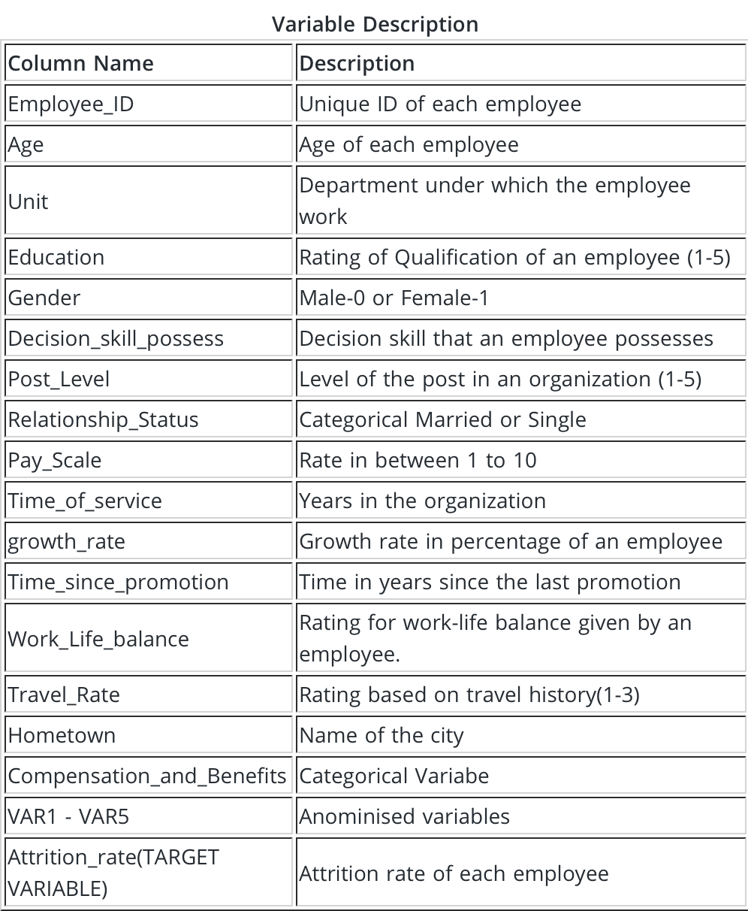

# *Predicting the employee attrition rate in organizations*
Employees are the most important part of an organization. Successful employees meet deadlines, make sales, and build the brand through positive customer interactions.

Employee attrition is a major cost to an organization and predicting such attritions is the most important requirement of the Human Resources department in many organizations.

## Data

• Train.csv  
• Test.csv

## Evaluation criteria

The evaluation metric that is used for this problem is the root mean squared error. The formula is as follows:

*score = 100 x max(0, 1 - root_mean_squared_error(actual_values, predicted_values))*

## <ins>Summary</ins>

The above submission to the hackathon recieved a score of 81.267 (max of 81.699) which was ranked 252 out of 5164 participants. Data was first cleaned based on different derived criteria and then scaled. Features were generated based on the intuition of the data. There were anonymized variables (VAR2 & VAR3) in the data which were handeled very carefully. Finally, combinations of algorithms were tried out of which *XGBoost* stood out.
